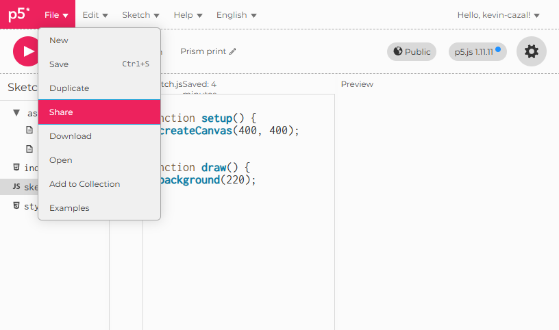
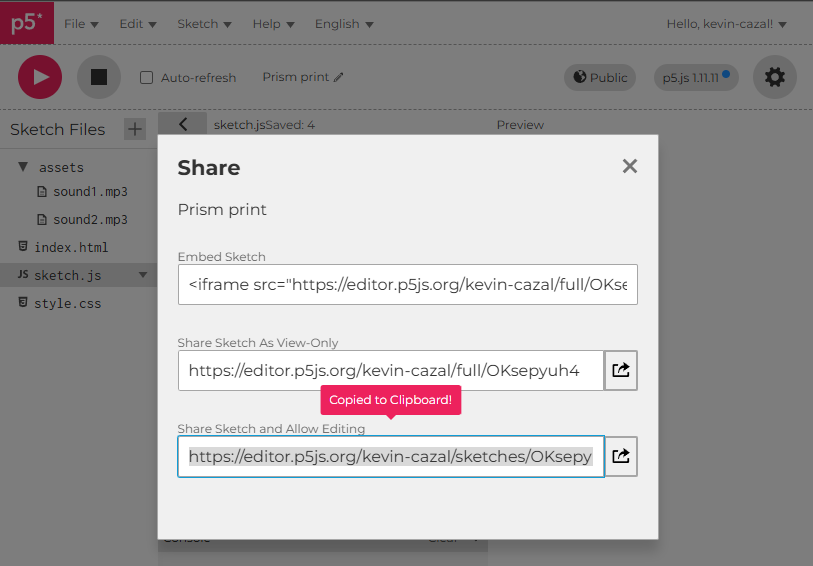
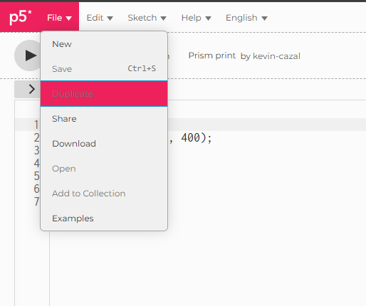

# DJ Mixing Deck Workshop - Assistant Guide

This guide is for **workshop assistants** organizing and running the DJ Mixing Deck workshop. It explains how to structure and deliver the workshop to participants.

## Workshop Structure

The workshop is organized into 3 progressive parts, each building on the previous one:

```
p5js_dj/
├── part1_starter/          # Part 1: Basic DJ Mixing Deck
│   ├── sketch.js           # Reference code (ASSISTANTS ONLY)
│   ├── assets/             # Sound files (GIVE TO PARTICIPANTS)
│   └── workshop/           # Workshop documentation
│       ├── workshop.md     # Main workshop guide (GIVE TO PARTICIPANTS)
│       ├── workshop_fr.md  # Main workshop guide in French (GIVE TO PARTICIPANTS)
│       ├── detailed.md     # Detailed step-by-step guide (ASSISTANTS ONLY)
│       ├── detailed_fr.md  # Detailed guide in French (ASSISTANTS ONLY)
│       ├── tldr.md         # Quick reference (ASSISTANTS ONLY)
│       ├── README.md       # Workshop metadata (ASSISTANTS ONLY)
│       └── img/            # Workshop images and diagrams
│
├── part2_customization/    # Part 2: Adding Customization
│   ├── sketch.js           # Reference code (ASSISTANTS ONLY)
│   ├── assets/             # Sound files (GIVE TO PARTICIPANTS)
│   └── workshop/           # Workshop documentation
│       ├── workshop.md     # Main workshop guide (GIVE TO PARTICIPANTS)
│       ├── workshop_fr.md  # Main workshop guide in French (GIVE TO PARTICIPANTS)
│       ├── detailed.md     # Detailed step-by-step guide (ASSISTANTS ONLY)
│       ├── detailed_fr.md  # Detailed guide in French (ASSISTANTS ONLY)
│       ├── tldr.md         # Quick reference (ASSISTANTS ONLY)
│       ├── README.md       # Workshop metadata (ASSISTANTS ONLY)
│       └── img/            # Workshop images and diagrams
│
├── part3_advanced/         # Part 3: Advanced Features
│   ├── sketch.js           # Reference code (ASSISTANTS ONLY)
│   ├── assets/             # Sound files (GIVE TO PARTICIPANTS)
│   └── workshop/           # Workshop documentation
│       ├── workshop.md     # Main workshop guide (GIVE TO PARTICIPANTS)
│       ├── workshop_fr.md  # Main workshop guide in French (GIVE TO PARTICIPANTS)
│       ├── detailed.md     # Detailed step-by-step guide (ASSISTANTS ONLY)
│       ├── detailed_fr.md  # Detailed guide in French (ASSISTANTS ONLY)
│       ├── tldr.md         # Quick reference (ASSISTANTS ONLY)
│       ├── README.md       # Workshop metadata (ASSISTANTS ONLY)
│       └── img/            # Workshop images and diagrams
│
└── appendix/               # Additional Resources
    ├── javascript_basics.md        # JavaScript basics tutorial (GIVE TO PARTICIPANTS)
    └── javascript_basics_fr.md     # JavaScript basics tutorial in French (GIVE TO PARTICIPANTS)
```

## Files Distribution

### Files for Participants
- ✅ **`workshop.md`** - Main workshop guide with step-by-step instructions
- ✅ **`workshop_fr.md`** - Main workshop guide in French
- ✅ **`assets/`** - Sound files needed for the project
- ✅ **`appendix/javascript_basics.md`** - JavaScript basics tutorial (optional reference for beginners)
- ✅ **`appendix/javascript_basics_fr.md`** - JavaScript basics tutorial in French (optional reference for beginners)

### Files for Assistants Only
- 🔒 **`sketch.js`** - Complete reference code (participants should not see this)
- 🔒 **`detailed.md`** - Detailed explanations for assistants
- 🔒 **`detailed_fr.md`** - Detailed guide in French for assistants
- 🔒 **`tldr.md`** - Quick reference
- 🔒 **`README.md`** - Workshop metadata

**Important**: Participants should work through the workshop without seeing the reference code or assistant-only documentation. This encourages learning through doing.

## Setup Instructions

### Prerequisites
- **p5.js Web Editor**: All work should be done in the p5.js web editor
- **p5.sound Library**: Version 1.11.11 (must be included)
- **Assets**: Sound files from the `assets/` folder

### Pre-Workshop Setup (Part 1)

**Before the workshop starts**, assistants should:

1. **Ensure participants have p5.js accounts**:
   - Ask participants to create a free p5.js account at [editor.p5js.org](https://editor.p5js.org/) before the workshop begins
   - Participants need to be logged in to save their work and use the File > Duplicate feature
   - This should be done during the introduction phase or communicated beforehand

2. **Create a p5.js template**:
   - Open [p5.js web editor](https://editor.p5js.org/)
   - Include the p5.sound library (version 1.11.11)
   - Upload the default sound files from `part1_starter/assets/` to the p5.js editor (or use your own favorite songs)
   - Add only the bootstrap code (see below)
   - Save and share the link with participants

2. **Bootstrap code template**:
   ```javascript
   function preload() {
       // Sounds will be loaded here
   }

   function setup() {
       createCanvas(800, 600);
   }

   function draw() {
       background(255);
   }
   ```


3. **Share the template link**:
   - Share the p5.js editor link with participants
   - Participants can duplicate this template by using File > Duplicate in the p5.js Web Editor
   - This ensures everyone has the assets uploaded and ready to use


**Assistants:** Click the "Share" button to get a template link.



**Participants:** Use "File > Duplicate" in the p5.js Web Editor to create your own copy of the template.



**Why this approach?**
- Participants don't need to manually upload assets at the start
- Everyone starts with the same setup
- Focuses attention on learning the code, not file management
- Assets are already in the p5.js editor, ready to reference

### During the Workshop

1. **Part 1: Starter**
   - Participants follow `workshop.md`
   - They build the basic DJ mixing deck from scratch
   - Assistants use `detailed.md` for explanations and troubleshooting

2. **Part 2: Customization**
   - Participants continue building on their Part 1 code
   - They add file upload features and mobile support
   - Assistants use `detailed.md` and `tldr.md` for quick reference

3. **Testing Phase** (Between Part 2 and Part 3)
   - **Important break**: Have participants test their DJ app!
   - Open their DJ app in the p5.js editor
   - Connect to a speaker or headphones
   - Load their own music files
   - **Start mixing!** Let them experiment and have fun
   - This reinforces what they've learned and motivates them for Part 3

4. **Part 3: Advanced**
   - Participants add advanced features (time sliders, crossfader, BPM visualization)
   - They learn code organization and refactoring
   - Assistants use `detailed.md` for in-depth explanations

## Parts Overview

### Part 1: Starter
**Basic DJ Mixing Deck**
- Two play/pause buttons
- Two volume sliders
- Basic mixing functionality
- Simple, clean interface
- **Learning focus**: Objects, sound loading, buttons, sliders, event handling

### Part 2: Customization
**Adding Customization Features**
- File upload for background images
- File upload for track sounds
- Mobile-friendly design
- Touch support
- Responsive layout
- **Learning focus**: File handling, responsive design, mobile development

### Part 3: Advanced
**Advanced DJ Features**
- Time sliders (seek/jump in tracks)
- Time display (MM:SS format)
- Crossfader for smooth transitions
- BPM visualization (pulsating circles)
- All customization features from Part 2
- Refactored code with helper functions
- **Learning focus**: Advanced audio control, trigonometry, code organization

## Difficulty Level Estimation

Based on Source Lines of Code (SLOC) analysis, here's a rough estimation of difficulty progression:

| Part | Code Lines | Increase | Difficulty Level |
|------|------------|----------|------------------|
| **Part 1: Starter** | 109 lines | Base | ⭐ Beginner |
| **Part 2: Customization** | 191 lines | +75.2% (+82 lines) | ⭐⭐ Intermediate |
| **Part 3: Advanced** | 297 lines | +55.5% (+106 lines) | ⭐⭐⭐ Advanced |

**Notes**:
- **Part 1 → Part 2**: The largest percentage increase (+75.2%) reflects the added complexity of file upload handling, grid system implementation, and UI management. This jump introduces new concepts (file I/O, responsive design).
- **Part 2 → Part 3**: A substantial increase (+55.5%) as participants add advanced features like time control, crossfader logic with trigonometry, and amplitude analysis for visualization.
- **Overall progression**: From Part 1 to Part 3, the codebase nearly triples (+172.5%), reflecting the cumulative learning and feature additions.

**Planning considerations**:
- Allow extra time for Part 2, as it has the steepest learning curve in terms of new concepts introduced.
- Part 3 builds incrementally but introduces more complex concepts (trigonometry, audio analysis).
- Consider pacing workshops with breaks between parts, especially between Part 2 and Part 3, to allow participants to digest the complexity.

## Assistant Resources

Each part includes assistant-only resources:

- **`sketch.js`** - Complete working reference code
  - Use this to understand the final result
  - Help troubleshoot participant issues
  - Never share this with participants!

- **`detailed.md`** - Detailed step-by-step guide
  - In-depth explanations of concepts
  - Additional context and examples
  - Troubleshooting tips

- **`tldr.md`** - Quick reference
  - Bullet points for quick lookup
  - Key code snippets
  - Fast reference during workshop

- **`README.md`** - Workshop metadata
  - Learning objectives
  - Prerequisites
  - Assessment criteria
  - Workshop structure details

### Appendix: JavaScript Basics Tutorial

The `appendix/` directory contains a JavaScript basics tutorial that can be given to participants:

- **`javascript_basics.md`** - JavaScript basics tutorial in English
- **`javascript_basics_fr.md`** - JavaScript basics tutorial in French

**When to share**: These tutorials are useful for participants who are completely new to JavaScript. You can:
- Share them before the workshop as optional pre-reading
- Provide them during the workshop if participants need a quick reference
- Use them as supplementary material for participants who want to understand JavaScript fundamentals better

**What it covers**: Only JavaScript concepts actually used in the workshop:
- Variables, objects, functions, conditions
- Numbers, strings, booleans
- Basic syntax and operations

**Important**: The tutorial emphasizes that reading without practicing is useless. Participants should try the examples as they read.

## Best Practices

1. **Don't share reference code**: Participants learn more by building from scratch
2. **Use the template**: Pre-upload assets to save time and avoid confusion
3. **Encourage experimentation**: The testing phase between Part 2 and 3 is crucial
4. **Be patient**: Some concepts (like objects) may be new to participants
5. **Use detailed.md**: It has extra explanations for common questions
6. **Test the template**: Make sure your p5.js template works before sharing
7. **Share the appendix**: If participants are new to JavaScript, offer the appendix tutorial as a reference

## Troubleshooting

- **Sounds not loading?** Check that assets are uploaded in p5.js editor
- **Library not found?** Verify p5.sound version 1.11.11 is included
- **Code not working?** Refer to `sketch.js` (assistants only) to see the solution
- **Participants stuck?** Use `detailed.md` for additional explanations

---

**Remember**: The goal is for participants to learn by building, not by copying. Keep the reference code and assistant materials separate from participant materials!
