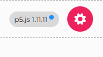
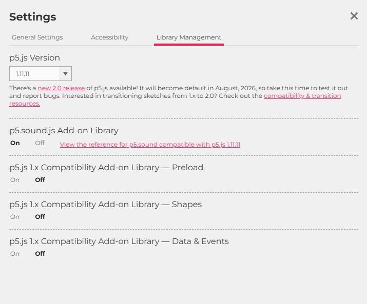

# Atelier : Table de Mixage DJ

Bienvenue dans l'atelier de création d'une table de mixage DJ avec p5.js ! Cet atelier vous guide à travers la création d'une application de mixage audio interactive, de la version de base jusqu'aux fonctionnalités avancées.

---

## Structure de l'atelier

L'atelier est organisé en 3 parties progressives, chacune construisant sur la précédente :

```
p5js_dj/
├── part0_starter/          # Partie 0 : Premiers pas
│   ├── sketch0.js          # Code de référence (ASSISTANTS UNIQUEMENT)
│   ├── workshop_fr.md      # Guide de l'atelier (PARTICIPANTS)
│   └── img/                # Images et diagrammes
│
├── part1_next/             # Partie 1 : Améliorations
│   ├── sketch1.js          # Code de référence (ASSISTANTS UNIQUEMENT)
│   ├── workshop_fr.md      # Guide de l'atelier (PARTICIPANTS)
│   └── img/                # Images et diagrammes
│
├── part2_advanced/         # Partie 2 : Fonctionnalités avancées
│   ├── sketch2.js          # Code de référence (ASSISTANTS UNIQUEMENT)
│   ├── workshop_fr.md      # Guide de l'atelier (PARTICIPANTS)
│   └── img/                # Images et diagrammes
│
└── appendix/               # Ressources supplémentaires
    ├── javascript_basics.md        # Tutoriel JavaScript (PARTICIPANTS)
    └── javascript_basics_fr.md     # Tutoriel JavaScript en français (PARTICIPANTS)
```

---

## Vue d'ensemble des parties

### Partie 0 : Premiers pas (Part 0 Starter)

**Objectifs** : Créer votre première table de mixage de base

- Canvas responsive (plein écran)
- Deux boutons play/pause pour deux pistes
- Chargement de sons et d'images
- Fond personnalisable
- Compatible mobile (PWA)

**Concepts appris** :
- Variables et fonctions
- `preload()`, `setup()`, `draw()`
- Chargement de fichiers audio et images
- Création et positionnement de boutons
- Gestion des événements (clics)
- Design responsive avec `windowWidth` et `windowHeight`

**Fichiers** :
- `workshop_fr.md` - Guide complet de l'atelier
- `sketch0.js` - Code de référence (pour les assistants)

---

### Partie 1 : Améliorations (Part 1 Next)

**Prérequis** : Avoir terminé la Partie 0

**Objectifs** : Améliorer la table de mixage avec des fonctionnalités professionnelles

- Sliders de volume pour chaque piste
- Toggle play/pause (un seul bouton par piste)
- Système de grille pour le positionnement responsive
- Upload d'images de fond pendant l'exécution
- Upload de sons pour remplacer les pistes
- Labels et titre pour une interface claire

**Concepts appris** :
- Création et utilisation de sliders
- Fonctions de bascule (toggle)
- Système de grille pour le responsive design
- Gestion des uploads de fichiers
- Contrôle du volume en temps réel
- Organisation du code avec des fonctions helper

**Fichiers** :
- `workshop_fr.md` - Guide complet de l'atelier
- `sketch1.js` - Code de référence (pour les assistants)

---

### Partie 2 : Fonctionnalités avancées (Part 2 Advanced)

**Prérequis** : Avoir terminé la Partie 1

**Objectifs** : Ajouter des fonctionnalités DJ avancées

- Sliders de temps pour naviguer dans les pistes
- Affichage du temps au format MM:SS
- Crossfader avec transitions douces (trigonométrie)
- Visualisation de l'amplitude (cercles pulsants)
- Code organisé en fonctions réutilisables

**Concepts appris** :
- Navigation dans l'audio avec `sound.jump()`
- Formatage du temps
- Trigonométrie pour crossfade (`cos()`, `sin()`)
- Analyse d'amplitude audio avec `p5.Amplitude`
- Organisation et refactorisation du code

**Fichiers** :
- `workshop_fr.md` - Guide complet de l'atelier
- `sketch2.js` - Code de référence (pour les assistants)

---

## Instructions de configuration

### ⚠️ IMPORTANT : Version de p5.js

**ATTENTION** : La version p5.js 1.11.11 contient un bug qui peut causer des problèmes inattendus avec cette atelier.

**Solution** : Utilisez la version **p5.js 1.11.10** ou une version antérieure (comme 1.11.1).

Vous pouvez changer la version dans les paramètres de l'éditeur p5.js (icône d'engrenage en haut à droite).




### Prérequis

- **Éditeur p5.js Web** : Tout le travail doit être fait dans l'éditeur web p5.js
  - ⚠️ **Utilisez la version p5.js 1.11.10 ou antérieure** (la version 1.11.11 contient un bug)
  - Lien : [editor.p5js.org](https://editor.p5js.org/)
- **Bibliothèque p5.sound** : Doit être activée dans l'éditeur
- **Compte p5.js** : Les participants doivent créer un compte gratuit pour sauvegarder leur travail

### Configuration pré-atelier

**Avant que l'atelier commence**, les assistants devraient :

1. **Créer un template p5.js** :
   - Ouvrir l'[éditeur p5.js](https://editor.p5js.org/)
   - ⚠️ **Changer la version à p5.js 1.11.10 ou antérieure** (1.11.11 a un bug)
   - Inclure la bibliothèque p5.sound
   - Ajouter le code bootstrap de base :
   - Sauvegarder et partager le lien avec les participants


2. **Partager le template** :
   - Les participants peuvent dupliquer le template avec **File > Duplicate** dans l'éditeur p5.js
   - Cela assure que tout le monde part avec la même base


**Pourquoi cette approche ?**
- Les participants se concentrent sur l'apprentissage du code
- Tout le monde part avec la même configuration
- Pas besoin de gérer les fichiers manuellement au début

---

## Fichiers pour les participants

### Guides d'atelier
- ✅ **`workshop_fr.md`** - Guide principal de l'atelier avec instructions étape par étape
  - Disponible dans chaque partie (part0_starter, part1_next, part2_advanced)

### Ressources supplémentaires
- ✅ **`appendix/javascript_basics_fr.md`** - Tutoriel JavaScript de base (référence optionnelle pour débutants)
- ✅ **`appendix/javascript_basics.md`** - Tutoriel JavaScript de base en anglais

**Quand partager** : Ces tutoriels sont utiles pour les participants complètement nouveaux à JavaScript. Vous pouvez :
- Les partager avant l'atelier comme lecture optionnelle
- Les fournir pendant l'atelier si les participants ont besoin d'une référence rapide
- Les utiliser comme matériel supplémentaire

---

## Fichiers pour les assistants uniquement

- 🔒 **`sketch0.js`, `sketch1.js`, `sketch2.js`** - Code de référence complet
  - Utilisez-le pour comprendre le résultat final
  - Aidez à dépanner les problèmes des participants
  - **Ne jamais partager avec les participants !**

**Astuce**: faites un fork de ce dépôt, supprimez les solutions et partagez les liens avec les participants.

---

## Bonnes pratiques

1. **Ne pas partager le code de référence** : Les participants apprennent mieux en construisant depuis zéro
2. **Utiliser le template** : Pré-configurer l'environnement pour gagner du temps
3. **Encourager l'expérimentation** : La phase de test entre les parties est cruciale
4. **Être patient** : Certains concepts (comme les objets) peuvent être nouveaux pour les participants
5. **Tester le template** : Assurez-vous que votre template p5.js fonctionne avant de le partager

---

## Dépannage

- **Les sons ne se chargent pas ?** Vérifiez que les fichiers audio sont uploadés dans l'éditeur p5.js


- **Bibliothèque introuvable ?** Vérifiez que p5.sound est incluse et que vous utilisez p5.js 1.11.10 ou antérieure
- **Bugs inattendus ?** ⚠️ Vérifiez que vous n'utilisez **PAS** la version p5.js 1.11.11 (elle contient un bug). Utilisez 1.11.10 ou antérieure.
- **Le code ne fonctionne pas ?** Référez-vous à `sketch*.js` (assistants uniquement) pour voir la solution
- **Participants bloqués ?** Utilisez les guides `workshop_fr.md` pour des explications supplémentaires

---

## Niveaux de difficulté

| Partie | Lignes de code | Augmentation | Niveau de difficulté |
|--------|----------------|--------------|----------------------|
| **Partie 0 : Starter** | ~105 lignes | Base | ⭐ Débutant |
| **Partie 1 : Next** | ~208 lignes | +98% | ⭐⭐ Intermédiaire |
| **Partie 2 : Advanced** | ~388 lignes | +87% | ⭐⭐⭐ Avancé |

**Notes** :
- **Partie 0** : Introduction aux concepts de base de p5.js
- **Partie 0 → Partie 1** : Ajout de fonctionnalités professionnelles (sliders, uploads, grille)
- **Partie 1 → Partie 2** : Fonctionnalités avancées (navigation temporelle, crossfader, visualisation)

---

## Progression recommandée

1. **Partie 0** (1-2 heures)
   - Créer la table de mixage de base
   - Apprendre les concepts fondamentaux

2. **Pause et test** (15-30 minutes)
   - Tester l'application
   - Charger sa propre musique
   - Expérimenter et s'amuser !

3. **Partie 1** (2-3 heures)
   - Ajouter les fonctionnalités professionnelles
   - Améliorer l'interface

4. **Pause et test** (15-30 minutes)
   - Tester toutes les nouvelles fonctionnalités
   - Personnaliser l'interface

5. **Partie 2** (2-3 heures et même plus)
   - Ajouter les fonctionnalités avancées
   - Apprendre des concepts plus complexes

---

## Ressources supplémentaires

- **Documentation p5.js** : [p5js.org/reference](https://p5js.org/reference/)
- **Documentation p5.sound** : [p5js.org/reference/#/libraries/p5.sound](https://p5js.org/reference/#/libraries/p5.sound)
- **Éditeur p5.js** : [editor.p5js.org](https://editor.p5js.org/)

---

**Rappelez-vous** : L'objectif est que les participants apprennent en construisant, pas en copiant. Gardez le code de référence et les matériels d'assistant séparés des matériels des participants !


