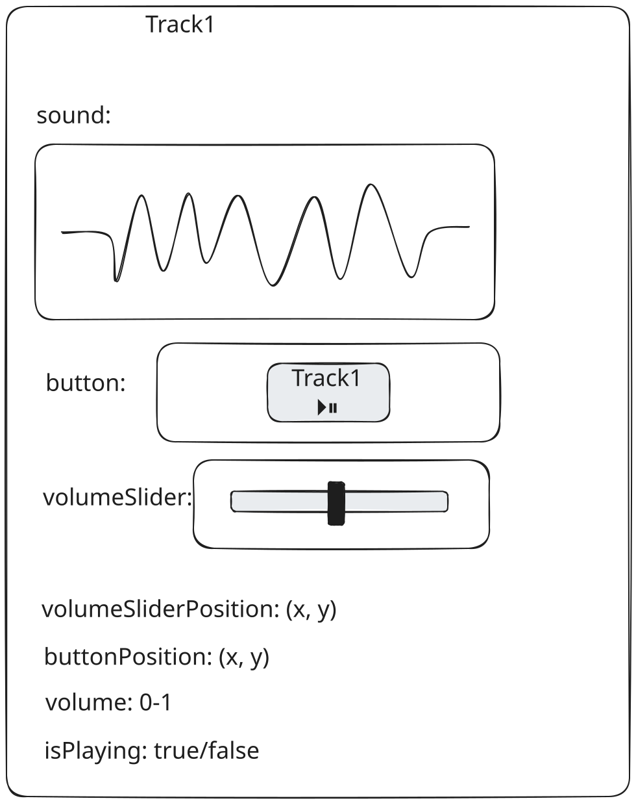
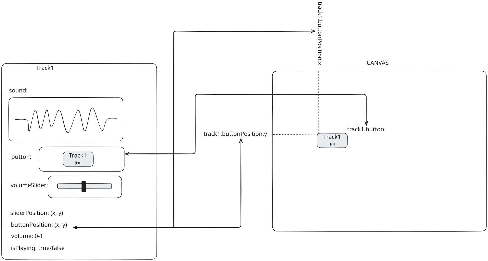
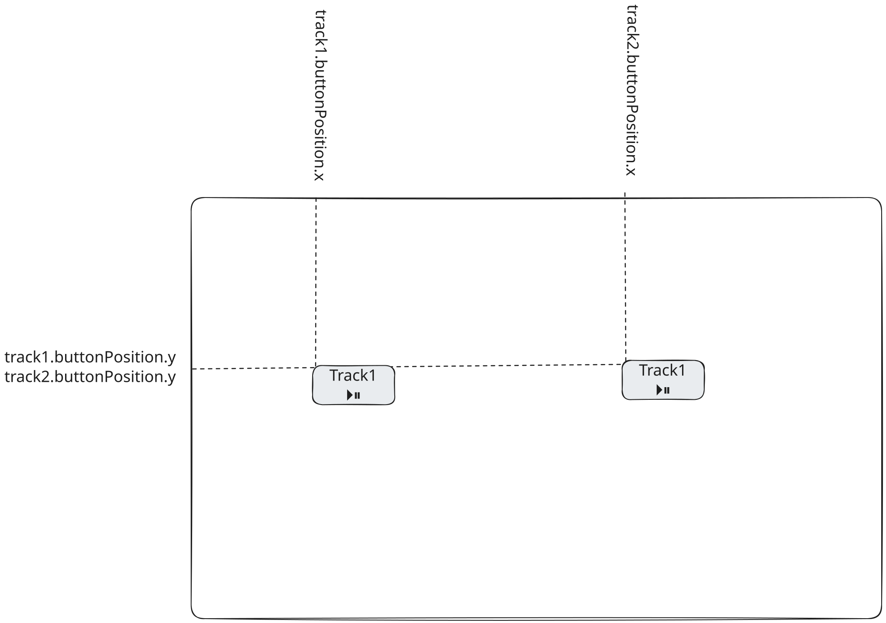
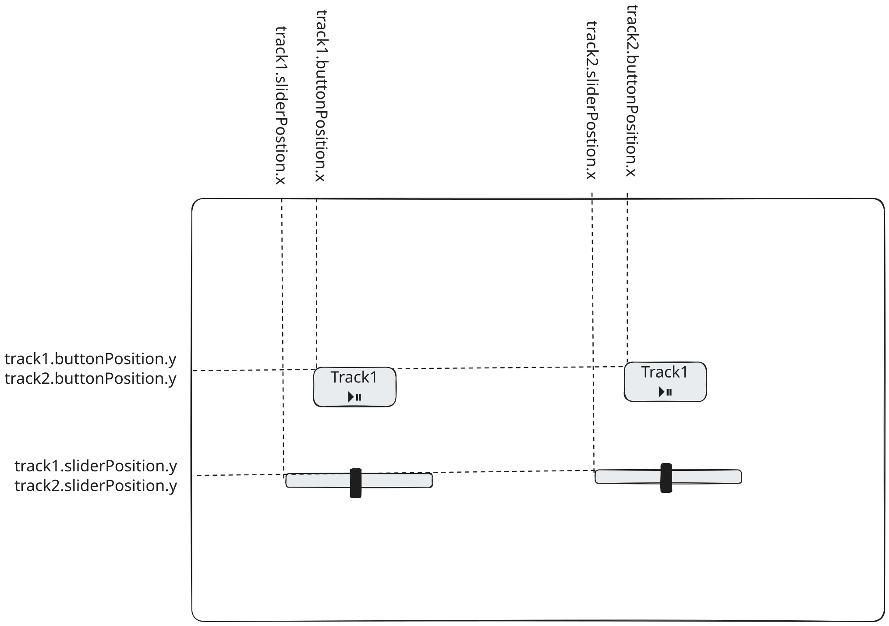
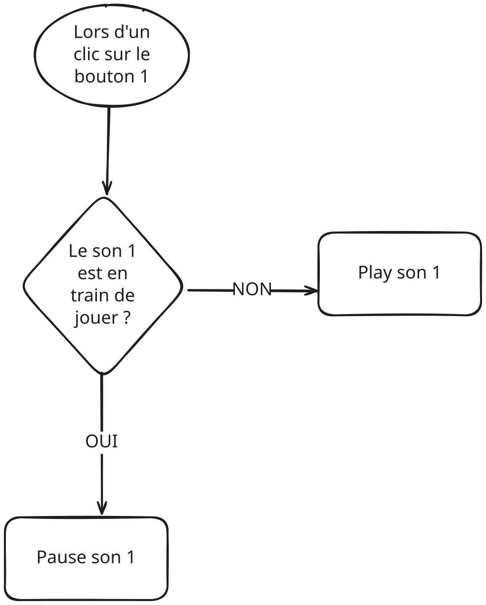
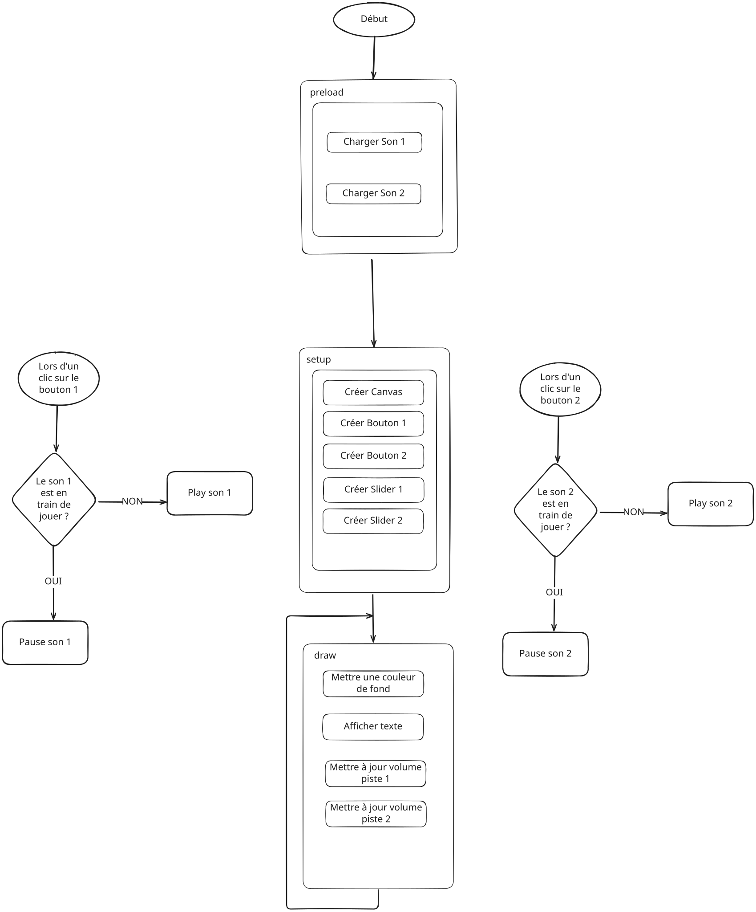

# Atelier : Créer une Table de Mixage DJ

Bienvenue dans l'atelier de création d'une table de mixage DJ ! À la fin de cette session, vous aurez créé une table de mixage entièrement fonctionnelle où vous pourrez jouer deux sons simultanément, contrôler leurs volumes indépendamment et les mélanger ensemble - comme un vrai DJ !

---

## Introduction : Ce que nous allons construire

Imaginez que vous êtes DJ à une fête. Vous avez deux platines (ou decks) devant vous. Chaque deck peut jouer une chanson différente, et vous pouvez contrôler le volume de chacune indépendamment. Vous pouvez démarrer et arrêter chaque piste, et les mélanger ensemble pour créer un son unique. C'est exactement ce que nous allons construire - mais en version numérique !

**Votre table de mixage aura :**
- Deux pistes qui peuvent jouer des sons
- Chaque piste a son propre bouton play/pause
- Chaque piste a son propre slider de volume
- Les deux pistes peuvent jouer en même temps (mixage !)
- Les sons jouent en boucle

**Connexion au monde réel** : C'est similaire au fonctionnement des logiciels DJ professionnels - plusieurs pistes, contrôles indépendants, et la capacité de mélanger les sons ensemble. Une fois que vous comprenez ces concepts, vous pouvez les appliquer pour créer des applications audio plus complexes !

### Pour commencer : Code de base

Avant de commencer, vous avez besoin d'un point de départ. Voici le code minimal pour faire fonctionner votre projet :

```javascript
function setup() {
    createCanvas(800, 600);
}

function draw() {
    background(255);
}
```

**Comprendre setup() et draw()** : Ce sont deux fonctions spéciales dans p5.js qui fonctionnent ensemble :

- **`setup()`** - Cette fonction s'exécute **une fois** au tout début lorsque votre programme démarre. C'est comme préparer votre espace de travail avant de commencer. Ici, elle crée votre canvas (votre zone de dessin). Utilisez `setup()` pour les choses qui ne doivent se produire qu'une seule fois : créer le canvas, charger les paramètres initiaux, créer les boutons et les curseurs.

- **`draw()`** - Cette fonction s'exécute **indéfiniment** (60 fois par seconde, en continu). C'est comme une boucle qui ne s'arrête jamais. À chaque image, p5.js appelle `draw()` pour mettre à jour et afficher tout à l'écran. Utilisez `draw()` pour les choses qui doivent se produire de manière répétée : dessiner des formes, mettre à jour les positions, vérifier les changements, lire les valeurs des curseurs.

**Pensez-y comme ceci** : 
- `setup()` = "Tout préparer" (se produit une fois)
- `draw()` = "Continuer à mettre à jour et afficher les choses" (se produit indéfiniment)

**Ce que ce code fait :**
- `setup()` crée votre canvas (votre zone de dessin) - s'exécute une fois au démarrage du programme
- `draw()` définit la couleur de fond en blanc - s'exécute en continu, rafraîchissant l'écran 60 fois par seconde

**Comprendre les fonctions** : Le code ci-dessus utilise des **fonctions** - ce sont comme des recettes qui contiennent des instructions. `setup()` et `draw()` sont des fonctions spéciales que p5.js appelle automatiquement. Nous créerons nos propres fonctions plus tard dans ce projet !

**Documentation** : Apprenez-en plus sur [`setup()`](https://p5js.org/reference/p5/setup) et [`draw()`](https://p5js.org/reference/p5/draw) dans la documentation p5.js.

---

## Comprendre la vue d'ensemble

Avant de commencer à coder, comprenons comment tout s'articule :

### Le concept clé : Les objets

Dans ce projet, nous allons utiliser **des objets** pour organiser notre code.

**Qu'est-ce qu'un objet ?** Un objet est comme un classeur avec plusieurs tiroirs. Chaque tiroir (appelé "propriété") a une étiquette et stocke quelque chose de spécifique. Tous les tiroirs appartiennent à un classeur (l'objet).

Toutes ces informations appartiennent ensemble car elles concernent UNE piste. C'est pourquoi nous les mettons toutes dans UN objet !

**Concept visuel** : 

---

## Étape 1 : Créer des objets Track

### Comprendre les objets

Un objet est un moyen de regrouper des informations liées ensemble. Au lieu d'avoir des variables séparées dispersées, nous mettons tout ce qui concerne une piste au même endroit.

**Pourquoi utiliser des objets ?**
- Cela garde les données liées organisées
- Cela rend le code plus facile à comprendre
- Cela rend le code plus facile à maintenir
- C'est ainsi que les développeurs professionnels organisent le code


### Étape 1A : Créer votre premier objet Track

**Comprendre les variables et les objets** : Avant de créer l'objet, comprenons ce que nous faisons :
- Une **variable** est comme une boîte étiquetée qui stocke des informations. Nous allons créer une variable appelée `track1` pour stocker les informations de notre piste.
- Un **objet** est une collection d'informations liées regroupées ensemble. Au lieu d'avoir des variables séparées comme `track1Sound`, `track1Volume`, etc., nous mettons tout ce qui concerne la piste 1 dans un objet.
- Une **propriété** est une information stockée dans un objet. Chaque propriété a un nom (comme `volume`) et une valeur (comme `0.5`).

**Le concept** : Chaque piste doit stocker :
- Le fichier son qu'elle jouera
- Le volume actuel (0.0 à 1.0)
- Si elle est actuellement en lecture (true/false)
- Un slider pour contrôler le volume (nous le créerons plus tard)
- Un bouton pour play/pause (nous le créerons plus tard)

**Ce que vous devez faire** : Créez un objet appelé `track1` qui contient toutes ces propriétés. Réfléchissez à ce que chaque propriété doit stocker :
- Le fichier son : commencez par `null` (nous le chargerons plus tard)
- Le volume : commencez par `0.5` (ce qui représente 50% de volume)
- Si elle est en lecture : commencez par `false` (pas encore en lecture)
- Le slider : commencez par `null` (nous le créerons plus tard)
- Le bouton : commencez par `null` (nous le créerons plus tard)
- La position du bouton : un objet avec les coordonnées x et y (x: 150, y: 200)
- La position du slider : un objet avec les coordonnées x et y (x: 150, y: 350)
- Le label du bouton : texte comme "Track 1"

**Pourquoi ces propriétés ?** Chaque propriété stocke une information sur la piste. En les mettant toutes dans un objet, nous pouvons facilement accéder à tout ce qui concerne la piste 1.


**Documentation** : Apprenez-en plus sur [les objets JavaScript](https://developer.mozilla.org/en-US/docs/Web/JavaScript/Guide/Working_with_Objects).

### Étape 1B : Créer votre deuxième objet Track

**La logique** : Vous avez besoin de deux pistes pour le mixage, donc vous avez besoin de deux objets track. Ils auront la même structure, mais des valeurs différentes.

**Ce que vous devez faire** : Créez un deuxième objet appelé `track2` avec la même structure que `track1`, mais avec des valeurs différentes :
- La coordonnée x de la position du bouton devrait être 450 (au lieu de 150) - cela le place à droite
- La coordonnée x de la position du slider devrait être 450 (au lieu de 150) - cela le place à droite
- Le label du bouton devrait être "Track 2" (au lieu de "Track 1")

**Logique de positionnement** : Pour placer les boutons côte à côte, donnez-leur des positions x différentes mais la même position y. Pensez-y comme placer deux objets sur la même étagère - ils sont à la même hauteur (y), mais à des positions horizontales différentes (x).

**Concept visuel** : 

**Testez !** Vous ne verrez rien encore, mais vos objets sont créés. Vérifiez la console pour toute erreur.

---

## Étape 2 : Créer les boutons

### Comprendre les boutons

Les boutons sont des éléments interactifs qui répondent aux clics. Dans p5.js, vous pouvez créer des boutons en utilisant `createButton()`, qui gère automatiquement la détection des clics pour vous.

**Qu'est-ce qui fait fonctionner un bouton ?**
- Position : où il apparaît à l'écran
- Label : texte qui indique à l'utilisateur ce qu'il fait
- Gestionnaire de clic : ce qui se passe quand vous cliquez dessus

**Exemple du monde réel** : Un interrupteur :
- Position : sur le mur (emplacement spécifique)
- Label : peut-être "Lumière de la cuisine" ou "Lumière du salon" écrit dessus
- Action : allume/éteint les lumières quand on appuie

### Étape 2A : Créer les boutons avec createButton()

**Pourquoi dans `setup()` ?** Les boutons sont créés une fois et restent à l'écran. Puisque `setup()` s'exécute une fois au début, c'est l'endroit parfait pour créer tous vos boutons. Vous ne voulez pas créer de nouveaux boutons 60 fois par seconde dans `draw()` - cela créerait des milliers de boutons !

**La logique** : Dans p5.js, vous pouvez créer des boutons en utilisant `createButton()`. Cela crée un élément bouton HTML qui gère automatiquement les clics - vous n'avez pas besoin de vérifier manuellement si la souris a cliqué sur le bouton !

**Ce que vous devez faire** : Dans `setup()`, après avoir créé le canvas, créez des boutons pour chaque piste. Pour chaque bouton :
1. Créez le bouton en utilisant le label du bouton de la piste
2. Positionnez-le en utilisant les coordonnées de position du bouton de la piste
3. Connectez-le à une fonction qui gérera le clic - pour l'instant, cette fonction peut simplement afficher un message dans la console avec `console.log()`

**Pourquoi utiliser createButton() ?**
- C'est plus simple que de dessiner les boutons manuellement
- Cela gère automatiquement la détection des clics
- Cela crée un vrai bouton HTML avec lequel les utilisateurs peuvent interagir

**La connexion** : Quand vous connectez un bouton à une fonction, vous dites "quand ce bouton est cliqué, exécute cette fonction." Pour l'instant, votre fonction peut simplement afficher un message pour vérifier que le bouton fonctionne.

**Concept visuel** : 

**Documentation** : [`createButton()`](https://p5js.org/reference/p5/createButton) crée un élément bouton.

**Testez !** Vous devriez voir deux boutons affichés à l'écran ! Cliquez sur les boutons et regardez la console dans l'éditeur p5.js (en bas de l'écran). Vous devriez voir vos messages `console.log()` apparaître chaque fois que vous cliquez sur un bouton. C'est une excellente façon de vérifier que vos boutons fonctionnent avant d'ajouter la fonctionnalité complète de play/pause !

---

## Étape 3 : Charger les sons

### Comprendre le chargement des sons

Les sons doivent être chargés avant de pouvoir les jouer. Dans p5.js, nous utilisons la fonction `preload()` pour charger les sons avant que le programme ne démarre.

**Comprendre la fonction preload()** : `preload()` est une fonction spéciale dans p5.js qui s'exécute automatiquement avant `setup()`. Elle est conçue pour charger des fichiers (comme des images et des sons) afin qu'ils soient prêts lorsque votre programme démarre. Pensez-y comme préparer les ingrédients avant de cuisiner - vous rassemblez tout ce dont vous avez besoin d'abord, puis vous pouvez les utiliser.

**Pourquoi preload() ?**
- Cela garantit que les sons sont prêts avant d'essayer de les utiliser
- Cela s'exécute avant `setup()`, donc tout est chargé quand le programme démarre
- Cela empêche les erreurs d'essayer de jouer des sons qui ne sont pas encore chargés


### Étape 3A : Charger les sons dans les objets Track

**Le concept** : Dans `preload()`, vous devez charger chaque fichier son et l'assigner à la propriété `sound` de la piste. Cela connecte le fichier son à l'objet track.

**Où vont les sons ?** Mettez vos fichiers son dans un dossier `assets` dans votre projet. Formats courants : WAV, MP3, OGG.

**Ce que vous devez faire** : Dans `preload()`, chargez deux fichiers son et assignez-les aux objets track :
- Chargez le premier fichier son depuis le dossier assets et assignez-le à `track1.sound`
- Chargez le deuxième fichier son depuis le dossier assets et assignez-le à `track2.sound`

**Le processus** : Pensez-y comme ceci - vous dites à p5.js "va chercher ce fichier son et stocke-le dans l'objet track pour que nous puissions l'utiliser plus tard."

**Documentation** : [`loadSound()`](https://p5js.org/reference/p5/loadSound/) charge les fichiers son. Note : Vous devez inclure la bibliothèque p5.sound !

**Testez !** Les sons devraient se charger sans erreur. Vérifiez la console si quelque chose ne va pas.

### Étape 3B : Définir le volume initial

**La logique** : Quand les sons sont chargés, vous devriez définir leur volume initial pour qu'ils soient prêts à jouer au bon niveau.

**Pourquoi dans `setup()` ?** Rappelez-vous, `setup()` s'exécute une fois au début. C'est parfait pour définir les valeurs initiales qui ne doivent se produire qu'une seule fois - comme définir le volume de départ. Nous n'avons pas besoin de définir le volume 60 fois par seconde, juste une fois au démarrage du programme !

**Ce que vous devez faire** : Dans `setup()`, après avoir créé le canvas et les boutons, définissez le volume pour les deux pistes. Vous utiliserez la valeur de volume stockée dans chaque objet track et l'appliquerez au son.

**Pourquoi ?** Cela garantit que les sons commencent au bon niveau de volume quand ils sont joués pour la première fois.

**Le processus** : Pour chaque piste, prenez la valeur de volume de l'objet track et appliquez-la au son. Cela connecte le réglage de volume à la lecture réelle du son.

**Documentation** : [`.setVolume()`](https://p5js.org/reference/p5.SoundFile/setVolume/) définit le volume d'un son.

---

## Étape 4 : Créer les sliders de volume

### Comprendre les sliders

Les sliders sont des contrôles qui permettent aux utilisateurs d'ajuster une valeur en glissant. Chaque piste a besoin de son propre slider pour contrôler son volume.

**Qu'est-ce qui fait fonctionner un slider ?**
- Une plage de valeurs (minimum et maximum)
- Une valeur actuelle (où le slider est positionné)
- Une position à l'écran (où il apparaît)

**Exemple du monde réel** : Un bouton de volume sur une chaîne stéréo :
- Plage : de silencieux (0) à maximum (100%)
- Valeur actuelle : où le bouton est tourné
- Position : sur le panneau de contrôle de la chaîne

### Étape 4A : Créer les sliders

**Pourquoi dans `setup()` ?** Tout comme les boutons, les sliders sont créés une fois et restent à l'écran. Puisque `setup()` s'exécute une fois au début, c'est l'endroit parfait pour créer tous vos sliders. Nous lirons leurs valeurs dans `draw()` (qui s'exécute en continu), mais nous ne les créons qu'une seule fois dans `setup()`.

**Le concept** : Dans p5.js, vous créez des sliders en utilisant `createSlider()`. Chaque piste a besoin de son propre slider.

**Ce que vous devez faire** : Dans `setup()`, après avoir créé les boutons, créez des sliders pour chaque piste. Pour chaque slider :
1. Créez un slider avec une plage de 0 à 100, commençant à 50 (ce qui représente 50% de volume)
2. Positionnez-le en utilisant les coordonnées de position du slider de la piste

**Pourquoi ces valeurs ?**
- 0 à 100 représente 0% à 100% de volume
- Commencer à 50 signifie que le slider commence à 50% de volume
- Nous convertirons cela en 0.0-1.0 plus tard quand nous l'appliquerons au son

**Pourquoi utiliser sliderPosition ?** Cela garde la position organisée dans l'objet track, ce qui facilite les modifications ultérieures. C'est comme avoir l'adresse écrite - vous pouvez la trouver facilement !

**Concept visuel** : 

**Documentation** : [`createSlider()`](https://p5js.org/reference/p5/createSlider) crée un élément slider.

**Testez !** Vous devriez voir deux sliders à l'écran que vous pouvez faire glisser !

### Étape 4B : Ajouter les labels de volume

**Qu'est-ce qu'un label ?** Un label (ou étiquette en français) est un texte qui explique ce que fait un élément de l'interface. C'est comme une petite note écrite qui dit "ceci contrôle le volume" ou "ce bouton sert à jouer la piste". Dans notre cas, nous voulons ajouter du texte qui dit "Volume" au-dessus de chaque slider pour que les utilisateurs sachent immédiatement ce que contrôlent ces sliders.

**Pourquoi dans `draw()` ?** Les labels sont dessinés sur le canvas, et tout ce qui est dessiné sur le canvas doit être dans `draw()` car `draw()` s'exécute en continu pour rafraîchir l'écran. Si vous dessinez du texte dans `setup()`, il n'apparaîtrait qu'une seule fois et pourrait être recouvert par le fond. Dans `draw()`, les labels sont redessinés à chaque image, donc ils restent toujours visibles.

**La logique** : Les utilisateurs doivent savoir ce que contrôlent les sliders. Ajouter des labels rend l'interface plus claire et plus facile à utiliser. Sans labels, les utilisateurs ne sauraient pas que les sliders contrôlent le volume !

**Ce que vous devez faire** : Dans votre fonction `draw()`, dessinez du texte au-dessus de chaque slider. Le texte devrait dire "Volume" et être positionné juste au-dessus de chaque slider. Pour dessiner du texte dans p5.js, vous utiliserez la fonction `text()`.

**Le processus** : Réfléchissez à où chaque slider est positionné, puis placez le texte légèrement au-dessus. Vous utiliserez la même coordonnée x que le slider, mais une coordonnée y légèrement plus petite (plus haut sur l'écran, car les coordonnées y augmentent vers le bas). Pensez-y comme placer une étiquette au-dessus d'un objet - vous voulez qu'elle soit au même endroit horizontalement (x), mais légèrement plus haute (y plus petit).

**Documentation** : [`text()`](https://p5js.org/reference/p5/text/) dessine du texte sur le canvas.

**Testez !** Vous devriez voir le texte "Volume" au-dessus de chaque slider !

---

## Étape 5 : Fonctionnalité Play/Pause

### Comprendre la logique de bascule

Une bascule change entre deux états. Pour play/pause :
- Si en lecture → mettez en pause
- Si pas en lecture → jouez-le

**Analogie du monde réel** : Un interrupteur :
- Si la lumière est allumée → éteignez-la
- Si la lumière est éteinte → allumez-la

### Étape 5A : Créer la fonction de bascule

**La logique** : Vous avez besoin d'une fonction qui bascule l'état de lecture d'une piste. Cette fonction devrait fonctionner pour n'importe quelle piste, donc elle prend un objet track en entrée.

**Ce que vous devez faire** : Créez une fonction qui :
1. Prend un objet track en entrée (pour qu'elle puisse fonctionner avec track1 ou track2)
2. Vérifie si le son de la piste est actuellement en lecture
3. Si en lecture : mettez-le en pause et mettez à jour l'état de lecture de la piste à false
4. Si pas en lecture :
   - Définissez le volume au réglage de volume actuel de la piste
   - Définissez-le en boucle (pour qu'il joue continuellement)
   - Commencez à le jouer
   - Mettez à jour l'état de lecture de la piste à true

**Pourquoi vérifier l'état d'abord ?** Parce que nous devons savoir quoi faire - s'il est en lecture, nous le mettons en pause ; s'il n'est pas en lecture, nous le jouons. C'est la logique de "bascule" - changer entre deux états.

**L'ordre compte** : Assurez-vous de définir le volume et les réglages de boucle avant de jouer, pour que le son commence avec les bons réglages.

**Documentation** :
- [`.isPlaying()`](https://p5js.org/reference/p5.SoundFile/isPlaying/) vérifie si le son est en lecture
- [`.pause()`](https://p5js.org/reference/p5.SoundFile/pause/) met le son en pause
- [`.play()`](https://p5js.org/reference/p5.SoundFile/play/) joue le son
- [`.setLoop()`](https://p5js.org/reference/p5.SoundFile/setLoop/) fait boucler le son

### Étape 5B : Connecter les boutons à la fonction de bascule

**La logique** : Maintenant que vous avez créé la fonction de bascule, vous devez remplacer les fonctions `console.log()` que vous avez utilisées dans l'étape 2 par la vraie fonction de bascule. Quand vous créez des boutons avec `createButton()`, vous les connectez à des fonctions en utilisant `.mousePressed()`. Cela gère automatiquement la détection des clics pour vous.

**Ce que vous devez faire** : Retournez à la partie de votre code où vous avez créé les boutons dans `setup()` (étape 2). Remplacez les fonctions `console.log()` par des appels à la fonction de bascule. Quand un bouton est cliqué, il devrait maintenant appeler la fonction de bascule avec l'objet track approprié au lieu d'afficher simplement un message dans la console.

**Pourquoi cela fonctionne ?** La méthode `.mousePressed()` détecte automatiquement quand le bouton est cliqué et appelle votre fonction. Pas besoin de vérifier manuellement les coordonnées de la souris ! C'est comme si le bouton "savait" quand il a été cliqué.

**La connexion** : Pensez-y comme ceci - le bouton est connecté à la fonction de bascule, et quand il est cliqué, il passe l'objet track à la fonction. De cette façon, la fonction sait quelle piste contrôler.

**Concept visuel** : 

**Documentation** : [`.mousePressed()`](https://p5js.org/reference/p5.Element/mousePressed) connecte une fonction aux clics de bouton.

**Testez !** Cliquez sur les boutons - les sons devraient jouer et se mettre en pause !

---

## Étape 6 : Contrôle du volume

### Comprendre les mises à jour en temps réel

Le volume doit se mettre à jour continuellement pendant que l'utilisateur déplace le slider. Cela se produit dans la fonction `draw()`, qui s'exécute plusieurs fois par seconde.

**Pourquoi utiliser `draw()` pour cela ?** Rappelez-vous, `draw()` s'exécute indéfiniment (60 fois par seconde). Cela le rend parfait pour vérifier les choses qui changent continuellement, comme les positions des sliders. À chaque image, nous vérifions la valeur du slider et mettons à jour le volume. Cela crée un contrôle fluide en temps réel - lorsque vous déplacez le slider, le volume change immédiatement !

**La logique** :
1. Lisez la valeur actuelle du slider
2. Convertissez-la en volume (0.0 à 1.0)
3. Appliquez-la au son s'il est en lecture

### Étape 6A : Lire les valeurs des sliders

**Le concept** : Les sliders retournent des valeurs de 0 à 100, mais les sons ont besoin de valeurs de 0.0 à 1.0. Vous devez convertir entre ces deux échelles.

**Ce que vous devez faire** : Dans votre fonction `draw()`, lisez la valeur du slider de chaque piste et convertissez-la en volume. La conversion est simple - divisez la valeur du slider par 100. Cela convertit du pourcentage (0-100) au décimal (0.0-1.0).

**Pourquoi diviser par 100 ?**
- Les sliders utilisent 0-100 (pourcentage) - c'est intuitif pour les utilisateurs (50 = 50%)
- Les sons utilisent 0.0-1.0 (décimal) - c'est ce que la bibliothèque son attend
- Diviser par 100 convertit entre eux : 50 ÷ 100 = 0.5

**Le processus** : Pour chaque piste, lisez la valeur du slider, divisez par 100, et stockez-la dans la propriété volume de la piste. Cela se produit à chaque frame, donc le volume se met à jour en temps réel pendant que l'utilisateur déplace le slider.

### Étape 6B : Appliquer le volume aux sons en lecture

**La logique** : Mettez à jour le volume uniquement pour les sons qui sont actuellement en lecture. Il n'y a pas de raison de mettre à jour le volume d'un son qui n'est pas en lecture.

**Ce que vous devez faire** : Dans votre fonction `draw()`, après avoir mis à jour les valeurs de volume depuis les sliders, vérifiez si le son de chaque piste est en lecture. Si c'est le cas, appliquez le nouveau volume au son.

**Pourquoi vérifier si en lecture ?**
- Si un son n'est pas en lecture, il n'y a pas besoin de mettre à jour son volume
- C'est plus efficace de ne mettre à jour que quand c'est nécessaire
- Quand le son commencera à jouer plus tard, il utilisera le réglage de volume actuel

**Le processus** : Pour chaque piste, vérifiez si le son est en lecture. Si oui, prenez la valeur de volume que vous venez de calculer et appliquez-la au son. Cela fait que le volume change en douceur pendant que vous déplacez le slider.

**Testez !** Déplacez les sliders pendant que les sons jouent - le volume devrait changer en temps réel !

---

## Étape 7 : Configurer le système de grille et le design responsive

### Comprendre le système de grille

Pour faciliter le positionnement et supporter les appareils mobiles, nous allons diviser le canvas en une grille 6x6. Cela signifie que nous diviserons l'écran en 6 colonnes et 6 lignes, ce qui facilite le positionnement précis des éléments d'interface et garantit qu'ils fonctionnent sur différentes tailles d'écran.

**Le concept** : Au lieu de calculer manuellement les positions en pixels comme `width / 6` ou `2 * height / 6`, vous pouvez créer des fonctions utilitaires qui convertissent les coordonnées de la grille (comme colonne 1, ligne 2) directement en coordonnées pixels.

**Pourquoi ?** Cela rend le positionnement beaucoup plus facile ! Au lieu d'écrire `width / 6` à chaque fois, vous pouvez simplement écrire `gridX(1)` pour la colonne 1, ou `gridY(2)` pour la ligne 2. De plus, cela rend votre application compatible avec les appareils mobiles !

### Étape 7A : Utiliser la taille complète de la fenêtre pour le canvas

**Ce que vous devez faire** : Mettez à jour votre appel `createCanvas()` dans `setup()` pour utiliser la taille complète de la fenêtre du navigateur au lieu d'une taille fixe.

Changez :
```javascript
createCanvas(800, 600);
```

En :
```javascript
createCanvas(windowWidth, windowHeight);
```

**Pourquoi utiliser `windowWidth` et `windowHeight` ?**

Utiliser `windowWidth` et `windowHeight` fait que votre table de mixage remplit automatiquement toute la fenêtre du navigateur, s'adaptant à n'importe quelle taille d'écran. Cela signifie :
- Votre table de mixage fonctionnera bien sur différentes tailles d'écran (ordinateur, tablette, mobile)
- Elle utilise automatiquement tout l'espace disponible
- Les utilisateurs n'ont pas besoin de redimensionner leur navigateur ou de voir de l'espace vide autour du canvas
- Cela offre une meilleure expérience utilisateur, plus professionnelle
- **Vous pouvez la publier comme application mobile !**

**Documentation** :
- [`windowWidth`](https://p5js.org/reference/p5/windowWidth/) - stocke la largeur de la fenêtre d'affichage du navigateur
- [`windowHeight`](https://p5js.org/reference/p5/windowHeight/) - stocke la hauteur de la fenêtre d'affichage du navigateur

**Important** : Puisque votre canvas s'adaptera maintenant à la taille de la fenêtre, tous vos éléments UI s'adapteront automatiquement avec le système de grille que vous allez créer !

### Étape 7B : Créer des fonctions utilitaires pour la grille

**Ce que vous devez faire** : Créez deux fonctions utilitaires qui convertissent les coordonnées de la grille en positions pixels :

1. `gridX(cellX)` - Prend un numéro de colonne (0-5) et retourne la position X en pixels
2. `gridY(cellY)` - Prend un numéro de ligne (0-5) et retourne la position Y en pixels

**La logique** :
- Pour une grille de 6 colonnes, la colonne 0 commence à la position X 0, la colonne 1 est à `width / 6`, la colonne 2 est à `2 * width / 6`, etc.
- Pour une grille de 6 lignes, la ligne 0 commence à la position Y 0, la ligne 1 est à `height / 6`, la ligne 2 est à `2 * height / 6`, etc.

**Exemple** :
- `gridX(0)` retourne `0` (bord gauche)
- `gridX(1)` retourne `width / 6` (colonne 1)
- `gridX(3)` retourne `3 * width / 6` (colonne 3)
- `gridY(0)` retourne `0` (bord supérieur)
- `gridY(1)` retourne `height / 6` (ligne 1)
- `gridY(2)` retourne `2 * height / 6` (ligne 2)

**Indice** : Utilisez la multiplication ! `gridX(cellX)` devrait retourner `cellX * width / 6`.

### Étape 7C : Mettre à jour la visualisation de la grille

**Ce que vous devez faire** : Mettez à jour votre fonction `drawGrid()` pour utiliser les nouvelles fonctions utilitaires `gridX()` et `gridY()`.

**La logique** :
- Utilisez vos fonctions `gridX()` et `gridY()` dans le code de dessin de la grille
- Faites une boucle de 1 à 5 et dessinez des lignes à `gridX(i)` et `gridY(i)`

**Astuce** : Cela rend votre code de grille plus propre et plus facile à comprendre !

### Étape 7D : Repositionner les éléments UI existants en utilisant la grille

**Ce que vous devez faire** : Mettez à jour vos éléments UI existants pour utiliser le système de grille.

**Repositionnez-les en utilisant vos fonctions utilitaires de grille** :
- Bouton piste 1 : Colonne 1, Ligne 2 (utilisez `gridX(1)`, `gridY(2)`)
- Slider piste 1 : Colonne 1, Ligne 3 (utilisez `gridX(1)`, `gridY(3)`)
- Bouton piste 2 : Colonne 4, Ligne 2 (utilisez `gridX(4)`, `gridY(2)`)
- Slider piste 2 : Colonne 4, Ligne 3 (utilisez `gridX(4)`, `gridY(3)`)
- Titre : Centre (utilisez `width / 2`, `gridY(1) / 2`)
- Labels de volume : Au-dessus des sliders (utilisez `gridX(1)`, `gridY(3) - 20` et `gridX(4)`, `gridY(3) - 20`)

**Mettez à jour votre code de positionnement** pour utiliser `gridX()` et `gridY()` au lieu de calculer manuellement `width / 6` ou `height / 6`.

**Important** : Utilisez le système de grille pour tout le positionnement UI à partir de maintenant ! Cela rendra beaucoup plus facile d'ajouter de nouveaux éléments plus tard.

**Testez !** Assurez-vous que tous vos boutons et sliders existants fonctionnent toujours et sont correctement positionnés sur la grille. Essayez de redimensionner la fenêtre du navigateur - tout devrait s'adapter !

---

## Étape 8 : Ajouter l'upload d'images de fond

### Comprendre les uploads de fichiers

Les uploads de fichiers permettent aux utilisateurs de sélectionner des fichiers depuis leur ordinateur et de les utiliser dans votre programme. Pensez-y comme choisir une photo à uploader sur les réseaux sociaux - vous cliquez sur un bouton, sélectionnez un fichier, et il devient partie de l'application.

### Comment fonctionnent les uploads de fichiers dans p5.js

Dans p5.js, vous utilisez `createFileInput()` pour créer un bouton d'upload de fichier. Quand un utilisateur sélectionne un fichier, p5.js vous donne des informations sur ce fichier, et vous pouvez l'utiliser dans votre programme.

**Le processus** :
1. Créez un bouton de saisie de fichier
2. L'utilisateur clique et sélectionne un fichier
3. Votre programme reçoit les informations du fichier
4. Vous chargez et utilisez le fichier (image ou son)

**Documentation** : [`createFileInput()`](https://p5js.org/reference/p5/createFileInput) crée un bouton d'upload de fichier.

### Étape 8A : Créer une variable pour l'image de fond

**Le concept** : Vous avez besoin d'un endroit pour stocker l'image uploadée.

**Ce que vous devez faire** : En haut de votre code (avant les objets track), créez une variable pour stocker l'image de fond. Réfléchissez à la valeur initiale - nous n'avons pas encore d'image, donc quelle devrait être la valeur initiale ?

**Pourquoi `null` ?** Cela signifie "pas d'image encore" - nous la définirons quand un utilisateur upload une image. C'est un modèle courant en programmation - utiliser `null` pour représenter "rien encore" ou "pas encore défini".

### Étape 8B : Créer le bouton de saisie de fichier

**La logique** : Dans `setup()`, créez un bouton de saisie de fichier pour les images.

**Ce que vous devez faire** : Dans `setup()`, après avoir créé le canvas, créez un bouton de saisie de fichier. Réfléchissez à :
1. Quelle fonction devrait s'exécuter quand un fichier est sélectionné ? (C'est la fonction de gestion)
2. Où ce bouton devrait-il être positionné à l'écran ? (Utilisez vos fonctions `gridX()` et `gridY()` !)
3. Comment pouvez-vous restreindre la sélection de fichiers aux images uniquement ?

**Astuce de positionnement** : Utilisez vos fonctions `gridX()` et `gridY()` ! Par exemple, pour positionner à la colonne 1, ligne 0, utilisez `gridX(1)` et `gridY(1) / 2`.

**Comprendre le code** :
- `createFileInput()` crée le bouton
- Le nom de fonction `handleBackgroundImage` est ce qui s'exécute quand un fichier est sélectionné
- `position()` le place à l'écran
- `attribute('accept', 'image/*')` restreint la sélection de fichiers aux images uniquement

**Documentation** : 
- [`createFileInput()`](https://p5js.org/reference/p5/createFileInput)
- [`.position()`](https://p5js.org/reference/p5.Element/position)
- [`.attribute()`](https://p5js.org/reference/p5.Element/attribute)

### Étape 8C : Créer la fonction de gestion

**La logique** : Quand un utilisateur sélectionne un fichier image, vous avez besoin d'une fonction pour le gérer.

**Ce que vous devez faire** : Créez une fonction qui gère quand un utilisateur sélectionne un fichier image. Réfléchissez à :
1. Quelles informations cette fonction recevra-t-elle sur le fichier sélectionné ?
2. Comment pouvez-vous vérifier si le fichier est réellement une image (pas un autre type) ?
3. Si c'est une image, comment la chargez-vous et la stockez-vous dans votre variable ?

**Comprendre le code** :
- `file.type` vous indique quel type de fichier c'est
- `file.data` contient les données du fichier que p5.js peut utiliser
- `loadImage()` charge une image depuis les données du fichier

**Documentation** : [`loadImage()`](https://p5js.org/reference/p5/loadImage) charge les fichiers image.

**Testez !** Essayez d'uploader une image - vous devriez voir le bouton de saisie de fichier !

### Étape 8D : Afficher l'image de fond

**La logique** : Dans `draw()`, vérifiez si une image est chargée, et si oui, affichez-la comme fond.

**Ce que vous devez faire** : Dans votre fonction `draw()`, au tout début, vous devez décider quoi dessiner comme fond. Réfléchissez à :
1. Comment pouvez-vous vérifier si une image a été uploadée ?
2. Si une image existe, comment la dessinez-vous pour remplir tout le canvas ?
3. Si aucune image n'existe encore, quel devrait être le fond ?

**Comprendre le code** :
- `if (bgImage)` vérifie si une image a été uploadée
- `image()` dessine l'image pour remplir tout le canvas
- `width` et `height` la font remplir la taille du canvas

**Documentation** : [`image()`](https://p5js.org/reference/p5/image) dessine les images.

**Testez !** Uploadez une image - elle devrait maintenant apparaître comme fond !

---

## Étape 9 : Ajouter l'upload de sons pour les pistes

### Comprendre les uploads de sons

Maintenant, vous voulez que les utilisateurs uploadent leurs propres sons pour chaque piste. C'est similaire aux uploads d'images, mais pour les fichiers audio.

**La logique** :
1. Ajoutez une propriété file input à l'objet track
2. Créez un bouton de saisie de fichier dans `setup()`
3. Quand un fichier est sélectionné, gérez-le
4. Chargez le son et remplacez celui existant

### Étape 9A : Ajouter la propriété File Input aux objets Track

**Le concept** : Chaque piste doit stocker son bouton de saisie de fichier.

**Ce que vous devez faire** : Dans les objets `track1` et `track2`, ajoutez une propriété pour stocker le bouton de saisie de fichier. Réfléchissez à la valeur initiale - nous n'avons pas encore créé le bouton, donc quelle devrait être la valeur initiale ?

**Pourquoi ?** Cela stocke le bouton de saisie de fichier, comme nous stockons le slider et le bouton. Garder tous les éléments UI d'une piste ensemble dans l'objet track rend le code plus organisé.

### Étape 9B : Créer les boutons de saisie de fichier

**La logique** : Dans `setup()`, créez des boutons de saisie de fichier pour les sons des deux pistes.

**Ce que vous devez faire** : Dans `setup()`, après avoir créé le bouton de saisie de fichier pour l'image de fond, créez des boutons de saisie de fichier pour la piste 1 et la piste 2. Réfléchissez à :
1. Quelle fonction devrait s'exécuter quand un fichier est sélectionné ? (Vous devrez passer à la fois le fichier et pour quelle piste c'est)
2. Où ces boutons devraient-ils être positionnés ? (Utilisez votre système de grille !)
3. Comment pouvez-vous restreindre la sélection de fichiers aux fichiers audio uniquement ?

**Comprendre le code** :
- `createFileInput()` avec une fonction qui appelle `handleSoundUpload()`
- Nous passons à la fois le fichier et l'objet track au gestionnaire
- `position()` les place en utilisant `gridX()` et `gridY()`
- `accept` restreint aux fichiers audio uniquement

### Étape 9C : Créer le gestionnaire d'upload de son

**La logique** : Quand un utilisateur sélectionne un fichier audio, vous devez le charger et remplacer le son existant.

**Ce que vous devez faire** : Créez une fonction qui gère quand un utilisateur sélectionne un fichier audio. Réfléchissez à :
1. De quelles informations cette fonction a-t-elle besoin ? (Le fichier, et pour quelle piste c'est)
2. Comment pouvez-vous vérifier si le fichier est réellement un fichier audio ?
3. S'il y a déjà un son en lecture, que devrait-il se passer ?
4. Comment chargez-vous le nouveau son et le rendez-vous prêt à jouer ?

**Comprendre le code** :
- `file.type === 'audio'` vérifie si c'est un fichier audio
- `track.sound.stop()` arrête le son actuel s'il est en lecture
- `loadSound(file.data)` charge le nouveau son depuis le fichier
- Nous définissons le volume pour qu'il soit prêt à jouer

**Important** : Si le son est en lecture quand un nouveau est uploadé, vous devriez :
- L'arrêter : `track.sound.stop()`
- Définir `track.isPlaying = false`

**Documentation** : [`loadSound()`](https://p5js.org/reference/p5.sound/p5.SoundFile) charge les fichiers son.

**Testez !** Uploadez des fichiers audio pour les deux pistes - ils devraient remplacer les sons par défaut !

---

## Étape 10 : Ajouter le support tactile pour mobile

### Comprendre les événements tactiles

Pour les appareils mobiles, vous devez gérer les événements tactiles différemment des clics de souris. Cela garantit que vos boutons fonctionnent correctement sur les téléphones et tablettes.

**La logique** : Les événements tactiles peuvent déclencher à la fois les événements tactiles et les événements souris sur les appareils mobiles, causant un double-clic sur les boutons. Nous devons empêcher ce double-déclenchement.

### Étape 10A : Ajouter les variables de support tactile

**Ce que vous devez faire** : En haut de votre code, ajoutez des variables pour suivre l'utilisation du tactile :
- `touchUsed` - un booléen pour suivre si le tactile a été récemment utilisé
- `touchTimeout` - une variable pour stocker le timeout

### Étape 10B : Mettre à jour les gestionnaires tactiles des boutons

**Ce que vous devez faire** : Pour chaque bouton, ajoutez un gestionnaire `touchStarted()` qui :
1. Définit `touchUsed = true` pour empêcher les événements souris de se déclencher
2. Appelle la fonction de bascule
3. Efface le drapeau après un délai
4. Empêche l'événement souris par défaut

**Comprendre le code** :
- `.touchStarted()` gère les événements tactiles sur le bouton
- Nous empêchons le double-déclenchement en vérifiant `touchUsed` dans `mousePressed()`
- `setTimeout()` efface le drapeau après 400ms
- `preventDefault()` arrête l'événement souris de se déclencher

**Testez !** Essayez votre table de mixage sur un appareil mobile - les boutons devraient fonctionner en douceur sans double-déclenchement !

---

## Étape 11 : Ajouter des labels et améliorer l'expérience utilisateur

### Ajouter des labels

**La logique** : Les utilisateurs doivent savoir ce que fait chaque bouton de saisie de fichier.

**Ce que vous devez faire** : Dans votre fonction `draw()`, ajoutez des labels de texte au-dessus de chaque bouton de saisie de fichier. Réfléchissez à :
1. Quel texte chaque label devrait-il dire ?
2. Où chaque label devrait-il être positionné ? (Juste au-dessus de son bouton correspondant)
3. Comment le texte devrait-il être aligné ?

Utilisez une taille de texte responsive : `textSize(min(width, height) * 0.025)` pour que les labels s'adaptent à la taille de l'écran.

**Testez !** Les labels devraient rendre clair ce que fait chaque bouton !

---

## Tout mettre ensemble

### Le flux complet

Votre table de mixage devrait maintenant fonctionner comme ceci :

1. **Setup** : Charger les sons, créer les boutons et sliders, définir le volume initial, créer les file inputs
2. **Boucle Draw** (s'exécute en continu) :
   - Dessiner le fond (image ou blanc)
   - Dessiner la grille
   - Dessiner les labels
   - Lire les valeurs des sliders et les convertir en volume
   - Appliquer le volume aux sons en lecture
3. **Détection des clics/tactiles** : Quand un bouton est cliqué ou touché, basculez l'état de lecture de cette piste
4. **Uploads de fichiers** : Les utilisateurs peuvent uploader des images de fond et des sons pour les pistes

**Concept visuel** : 

### Tester votre table de mixage

Testez chaque fonctionnalité :
- ✅ Cliquez sur le bouton track1 → sound1 joue
- ✅ Cliquez à nouveau sur le bouton track1 → sound1 se met en pause
- ✅ Cliquez sur le bouton track2 → sound2 joue
- ✅ Les deux pistes peuvent jouer en même temps (mixage !)
- ✅ Déplacez le slider track1 → le volume de track1 change
- ✅ Déplacez le slider track2 → le volume de track2 change
- ✅ Les sons bouclent continuellement
- ✅ Uploadez une image de fond → elle s'affiche comme fond
- ✅ Uploadez un son pour la piste 1 → il remplace le son par défaut
- ✅ Uploadez un son pour la piste 2 → il remplace le son par défaut
- ✅ Touchez les boutons sur mobile → ils fonctionnent sans double-déclenchement
- ✅ Redimensionnez la fenêtre du navigateur → tout s'adapte correctement

### Dépannage

**Pas de son ?**
- Vérifiez que la bibliothèque p5.sound est incluse
- Vérifiez que les fichiers son sont dans le dossier `assets` ou ont été uploadés
- Vérifiez la console du navigateur pour les erreurs

**Les boutons ne fonctionnent pas ?**
- Vérifiez que la logique de détection des clics est correcte
- Vérifiez que les positions des boutons correspondent à votre détection des clics
- Sur mobile, vérifiez que les événements tactiles sont correctement gérés

**Le volume ne change pas ?**
- Vérifiez que vous lisez les valeurs des sliders dans `draw()`
- Vérifiez que vous appliquez le volume aux sons en lecture
- Vérifiez que la conversion de volume (diviser par 100) est correcte

**L'image ne s'affiche pas après l'upload**
- Vérifiez que vous utilisez `image()` dans `draw()` et que vous vérifiez si `bgImage` existe

**Le son ne joue pas après l'upload**
- Assurez-vous que vous appelez `loadSound(file.data)` et que vous définissez le volume

---

## Idées de personnalisation

Maintenant que votre table de mixage fonctionne, essayez de la personnaliser :

- **Uploadez vos chansons préférées**
- **Uploadez des images de fond personnalisées**
- **Changez les positions et tailles des boutons**
- **Changez les positions des sliders**
- **Ajoutez un titre ou des labels**
- **Changez les couleurs**
- **Ajoutez plus de pistes**
- **Ajoutez un retour visuel quand les pistes jouent**
- **Partagez votre table de mixage comme application mobile !**

**Rappelez-vous** : L'expérimentation est la façon dont on apprend ! Essayez des choses, voyez ce qui se passe, et apprenez-en.

---

## Félicitations ! 🎉

Vous avez construit une table de mixage DJ entièrement fonctionnelle et personnalisable qui fonctionne sur ordinateur et mobile ! Vous avez appris :
- Comment organiser le code en utilisant des objets
- Comment charger et jouer plusieurs sons
- Comment créer des boutons interactifs avec support tactile
- Comment créer et utiliser des sliders
- Comment contrôler le volume en temps réel
- Comment mélanger les sons ensemble
- Comment utiliser un système de grille pour une mise en page responsive
- Comment gérer les uploads de fichiers (images et sons)
- Comment créer des interfaces compatibles mobile
- Comment publier votre application comme application mobile !

Ces concepts vous aideront à construire des applications interactives encore plus complexes !
