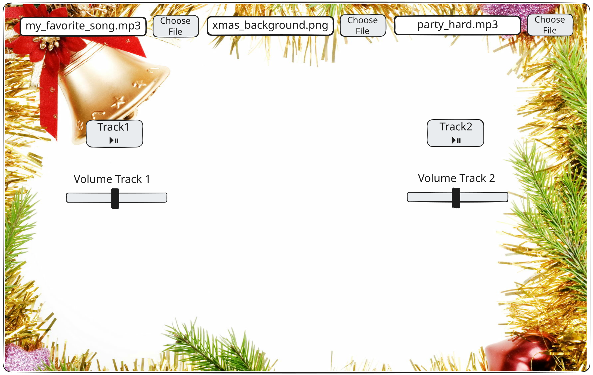
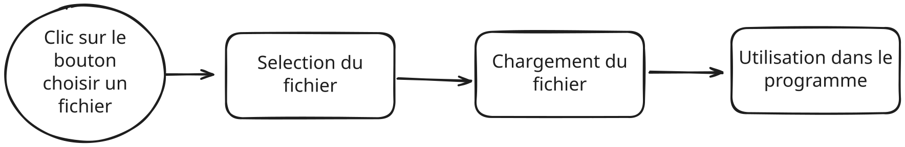

# Atelier : Table de Mixage DJ - Personnalisation

## Bienvenue !

Félicitations pour avoir terminé le DJ Mixing Deck Starter ! Maintenant, vous allez ajouter des fonctionnalités de personnalisation qui permettent aux utilisateurs d'uploader leurs propres sons et images de fond. Cela rend votre table de mixage DJ vraiment personnelle et unique !

---

## Ce que vous allez construire

À la fin de cet atelier, vous aurez :
- ✅ Une table de mixage DJ qui accepte les images de fond uploadées (envoyées par l'utilisateur)
- ✅ Des boutons d'upload de fichiers pour chaque piste
- ✅ La capacité de remplacer les sons par vos propres fichiers audio
- ✅ Une expérience de mixage DJ entièrement personnalisable
- ✅ **Design adapté au mobile** qui fonctionne sur les téléphones et tablettes
- ✅ **Support tactile** pour les appareils mobiles
- ✅ **Mise en page responsive** qui s'adapte à toute taille d'écran

---

## Étape 1 : Configurer le système de grille

### Comprendre le système de grille

Pour faciliter le positionnement, nous choisissons de diviser le canvas en une grille 6x6. Cela signifie que nous divisons l'écran en 6 colonnes et 6 lignes, ce qui facilite le positionnement précis des éléments d'interface.

**Le concept** : Au lieu de calculer manuellement les positions en pixels comme `width / 6` ou `2 * height / 6`, vous pouvez créer des fonctions utilitaires qui convertissent les coordonnées de la grille (comme colonne 1, ligne 2) directement en coordonnées pixels.

**Pourquoi ?** Cela rend le positionnement beaucoup plus facile ! Au lieu d'écrire `width / 6` à chaque fois, vous pouvez simplement écrire `gridX(1)` pour la colonne 1, ou `gridY(2)` pour la ligne 2.

### Étape 1A : Créer des fonctions utilitaires pour la grille

**Ce que vous devez faire** : Créez deux fonctions utilitaires qui convertissent les coordonnées de la grille en positions pixels :

1. `gridX(cellX)` - Prend un numéro de colonne (0-5) et retourne la position X en pixels
2. `gridY(cellY)` - Prend un numéro de ligne (0-5) et retourne la position Y en pixels

**La logique** :
- Pour une grille de 6 colonnes, la colonne 0 commence à la position X 0, la colonne 1 est à `width / 6`, la colonne 2 est à `2 * width / 6`, etc.
- Pour une grille de 6 lignes, la ligne 0 commence à la position Y 0, la ligne 1 est à `height / 6`, la ligne 2 est à `2 * height / 6`, etc.

**Exemple** :
- `gridX(0)` retourne `0` (bord gauche)
- `gridX(1)` retourne `width / 6` (colonne 1)
- `gridX(3)` retourne `3 * width / 6` (colonne 3)
- `gridY(0)` retourne `0` (bord supérieur)
- `gridY(1)` retourne `height / 6` (ligne 1)
- `gridY(2)` retourne `2 * height / 6` (ligne 2)

**Indice** : Utilisez la multiplication ! `gridX(cellX)` devrait retourner `cellX * width / 6`.

### Étape 1B : Ajouter une visualisation de la grille (Optionnel)

**Ce que vous devez faire** : Créez une fonction `drawGrid()` qui dessine les lignes de la grille sur le canvas. Cela vous aide à voir où se trouvent les cellules de la grille pendant que vous positionnez les éléments.

**La logique** :
- Dessinez des lignes verticales à `width / 6`, `2 * width / 6`, `3 * width / 6`, `4 * width / 6`, `5 * width / 6`
- Dessinez des lignes horizontales à `height / 6`, `2 * height / 6`, `3 * height / 6`, `4 * height / 6`, `5 * height / 6`
- Utilisez une couleur gris clair pour qu'elle soit visible mais pas distrayante

**Astuce** : Vous pouvez utiliser vos fonctions `gridX()` et `gridY()` ici ! Faites une boucle de 1 à 5 et dessinez des lignes à `gridX(i)` et `gridY(i)`.

Appelez `drawGrid()` dans votre fonction `draw()` pour voir la grille.

### Étape 1C : Repositionner les éléments UI existants en utilisant la grille

**Ce que vous devez faire** : Mettez à jour vos éléments UI existants de la Partie 1 pour utiliser le système de grille.

De la Partie 1, vous avez :
- Bouton et slider de la piste 1
- Bouton et slider de la piste 2

**Repositionnez-les en utilisant vos fonctions utilitaires de grille** :
- Bouton piste 1 : Colonne 1, Ligne 2 (utilisez `gridX(1)`, `gridY(2)`)
- Slider piste 1 : Colonne 1, Ligne 3 (utilisez `gridX(1)`, `gridY(3)`)
- Bouton piste 2 : Colonne 4, Ligne 2 (utilisez `gridX(4)`, `gridY(2)`)
- Slider piste 2 : Colonne 4, Ligne 3 (utilisez `gridX(4)`, `gridY(3)`)
- Titre : Centre (utilisez `width / 2`, `gridY(0)`)
- Labels de volume : Au-dessus des sliders (utilisez `gridX(1)`, `gridY(3) - 20` et `gridX(4)`, `gridY(3) - 20`)

**Mettez à jour votre fonction `updatePositions()`** (ou l'endroit où vous définissez les positions) pour utiliser `gridX()` et `gridY()` au lieu de calculer manuellement `width / 6` ou `height / 6`.

**Important** : Utilisez le système de grille pour tout le positionnement UI à partir de maintenant ! Cela rendra beaucoup plus facile d'ajouter de nouveaux éléments plus tard.

**Testez !** Assurez-vous que tous vos boutons et sliders existants fonctionnent toujours et sont correctement positionnés sur la grille.

---

## Étape 2 : Comprendre les uploads de fichiers

### Qu'est-ce qu'un upload de fichier ?

Un upload (de "envoyer" un fichier) permet aux utilisateurs de sélectionner des fichiers depuis leur ordinateur et de les utiliser dans votre programme. Pensez-y comme choisir une photo à envoyer sur les réseaux sociaux - vous cliquez sur un bouton, sélectionnez un fichier, et il devient partie de l'application.

### Comment fonctionnent les uploads de fichiers dans p5.js

Dans p5.js, vous utilisez `createFileInput()` pour créer un bouton d'upload de fichier. Quand un utilisateur sélectionne un fichier, p5.js vous donne des informations sur ce fichier, et vous pouvez l'utiliser dans votre programme.

**Le processus** :
1. Créez un bouton de saisie de fichier
2. L'utilisateur clique et sélectionne un fichier
3. Votre programme reçoit les informations du fichier
4. Vous chargez et utilisez le fichier (image ou son)

**Concept visuel** : 

**Documentation** : [`createFileInput()`](https://p5js.org/reference/p5/createFileInput) crée un bouton d'upload de fichier.

---

## Étape 3 : Ajouter l'upload d'image de fond

### Comprendre les uploads d'images

Vous voulez que les utilisateurs puissent uploader leur propre image de fond. Cela remplace le fond blanc par l'image qu'ils ont choisie.

**La logique** :
1. Créez un bouton de saisie de fichier pour les images
2. Positionnez-le à l'écran
3. Quand un fichier est sélectionné, vérifiez si c'est une image
4. Chargez l'image et stockez-la dans une variable
5. Affichez-la comme fond dans `draw()`

### Étape 2A : Créer une variable pour l'image de fond

**Le concept** : Vous avez besoin d'un endroit pour stocker l'image uploadée.

**Votre tâche** : En haut de votre code (avant les objets track), créez une variable :
- `let bgImage = null;`

**Pourquoi `null` ?** Cela signifie "pas d'image encore" - nous la définirons quand un utilisateur upload une image.

### Étape 2B : Créer le bouton de saisie de fichier

**La logique** : Créez une fonction utilitaire pour configurer tous les file inputs, en gardant le code organisé.

**Votre tâche** : Créez une fonction appelée `setupFileInputs()` qui :
1. Crée des file inputs pour la piste 1, l'image de fond et la piste 2
2. Les positionne à l'écran
3. Définit l'attribut accept pour chacun

Puis dans `setup()`, appelez `setupFileInputs()` après avoir créé le canvas.

**Comprendre le code** :
- `createFileInput()` crée le bouton
- Le nom de fonction `handleBackgroundImage` est ce qui s'exécute quand un fichier est sélectionné
- `position()` le place à l'écran - **utilisez `gridX()` et `gridY()` pour le positionner !**
- `attribute('accept', 'image/*')` restreint la sélection de fichiers aux images uniquement

**Astuce de positionnement** : Utilisez vos fonctions `gridX()` et `gridY()` ! Par exemple, pour positionner à la colonne 1, ligne 0, utilisez `gridX(1)` et `gridY(0)`. N'oubliez pas d'utiliser le système de grille pour tout le positionnement !

**Documentation** :
- [`createFileInput()`](https://p5js.org/reference/p5/createFileInput)
- [`.position()`](https://p5js.org/reference/p5.Element/position)
- [`.attribute()`](https://p5js.org/reference/p5.Element/attribute)

### Étape 2C : Créer la fonction de gestion

**La logique** : Quand un utilisateur sélectionne un fichier image, vous avez besoin d'une fonction pour le gérer.

**Votre tâche** : Créez une fonction appelée `handleBackgroundImage()` qui :
1. Prend un paramètre file
2. Charge l'image : `bgImage = loadImage(file.data)`

**Note** : La vérification du type de fichier est gérée par l'attribut `accept`, donc la fonction de gestion est simplifiée.

**Comprendre le code** :
- `file.type` vous indique quel type de fichier c'est
- `file.data` contient les données du fichier que p5.js peut utiliser
- `loadImage()` charge une image depuis les données du fichier

**Documentation** : [`loadImage()`](https://p5js.org/reference/p5/loadImage) charge les fichiers image.

**Testez !** Essayez d'uploader une image - vous devriez voir le bouton de saisie de fichier, mais l'image ne s'affichera pas encore (nous l'ajouterons ensuite).

### Étape 2D : Afficher l'image de fond

**La logique** : Créez une fonction utilitaire pour dessiner le fond, en gardant `draw()` organisé.

**Votre tâche** : Créez une fonction appelée `drawBackground()` qui :
1. Vérifie si `bgImage` existe (n'est pas null)
2. Si oui, la dessine : `image(bgImage, 0, 0, width, height)`
3. Si non, utilise le fond blanc normal : `background(255)`

Puis dans votre fonction `draw()`, appelez `drawBackground()` au début.

**Comprendre le code** :
- `if (bgImage)` vérifie si une image a été uploadée
- `image()` dessine l'image pour remplir tout le canvas
- `width` et `height` la font remplir la taille du canvas

**Documentation** : [`image()`](https://p5js.org/reference/p5/image) dessine les images.

**Testez !** Uploadez une image - elle devrait maintenant apparaître comme fond !

---

## Étape 4 : Ajouter l'upload de son pour la piste 1

### Comprendre les uploads de sons

Maintenant, vous voulez que les utilisateurs uploadent leurs propres sons pour chaque piste. C'est similaire aux uploads d'images, mais pour les fichiers audio.

**La logique** :
1. Ajoutez une propriété file input à l'objet track
2. Créez un bouton de saisie de fichier dans `setup()`
3. Quand un fichier est sélectionné, gérez-le
4. Chargez le son et remplacez celui existant

### Étape 3A : Ajouter la propriété File Input aux objets Track

**Le concept** : Chaque piste doit stocker son bouton de saisie de fichier.

**Votre tâche** : Dans les objets `track1` et `track2`, ajoutez :
- `fileInput: null`

**Pourquoi ?** Cela stocke le bouton de saisie de fichier, comme nous stockons le slider et le bouton.

### Étape 3B : Créer le bouton de saisie de fichier pour la piste 1

**La logique** : Le file input pour la piste 1 est créé dans la fonction `setupFileInputs()` (de l'étape 2B).

**Votre tâche** : Le file input de la piste 1 est déjà inclus dans `setupFileInputs()`. Cela garde toute la création de file inputs au même endroit, rendant le code plus organisé.

**Comprendre le code** :
- `createFileInput()` avec une fonction qui appelle `handleSoundUpload()`
- Nous passons à la fois le fichier et l'objet track au gestionnaire
- `position()` le place sous le bouton d'upload de fond

**Testez !** Vous devriez voir un deuxième bouton de saisie de fichier, mais il ne fonctionnera pas encore (nous ajouterons le gestionnaire ensuite).

### Étape 3C : Créer le gestionnaire d'upload de son

**La logique** : Quand un utilisateur sélectionne un fichier audio, vous devez le charger et remplacer le son existant. Le code est organisé en petites fonctions utilitaires.

**Votre tâche** : Créez une fonction appelée `handleSoundUpload()` qui :
1. Prend deux paramètres : `file` et `track`
2. Vérifie si le fichier est audio : `if (file.type === 'audio')`
3. Arrête le son actuel s'il est en lecture : `track.sound.stop()` et `track.isPlaying = false`
4. Charge le nouveau son : `track.sound = loadSound(file.data)`
5. Définit le volume : `track.sound.setVolume(track.volume)`

**Comprendre le code** :
- `file.type === 'audio'` vérifie si c'est un fichier audio
- `track.sound.stop()` arrête le son actuel s'il est en lecture
- `loadSound(file.data)` charge le nouveau son depuis le fichier
- Nous définissons le volume pour qu'il soit prêt à jouer

**Documentation** : [`loadSound()`](https://p5js.org/reference/p5.sound/p5.SoundFile) charge les fichiers son.

**Testez !** Uploadez un fichier audio pour la piste 1 - il devrait remplacer le son par défaut !

---

## Étape 5 : Ajouter l'upload de son pour la piste 2

### Répéter le processus

**La logique** : Le file input de la piste 2 est déjà créé dans la fonction `setupFileInputs()`.

**Votre tâche** : Le file input de la piste 2 est déjà inclus dans `setupFileInputs()`. La même fonction `handleSoundUpload()` fonctionne pour les deux pistes car nous passons l'objet track comme paramètre. C'est la réutilisation de code !

**Pourquoi les fonctions utilitaires ?** Diviser le code en petites fonctions le rend :
- Plus facile à comprendre
- Plus facile à tester
- Plus facile à maintenir
- Moins répétitif

**Testez !** Uploadez des fichiers audio pour les deux pistes - ils devraient tous les deux fonctionner !

---

## Étape 6 : Améliorer l'expérience utilisateur

### Ajouter des labels

**La logique** : Les utilisateurs doivent savoir ce que fait chaque bouton de saisie de fichier.

**Votre tâche** : Dans votre fonction `draw()`, ajoutez des labels de texte au-dessus de chaque file input :
- "choose track 1" à la position (width * 0.15, height * 0.12)
- "change background" à la position (width/2, height * 0.12)
- "choose track 2" à la position (width * 0.85, height * 0.12)

**Comprendre le code** :
- Utilisez `textAlign(CENTER)` pour centrer le texte
- Positionnez les labels juste au-dessus de chaque bouton de saisie de fichier
- Utilisez `fill(0)` pour le texte noir

**Testez !** Les labels devraient rendre clair ce que fait chaque bouton !

### Gérer les cas limites

**La logique** : Votre code devrait gérer les situations où les choses pourraient mal tourner.

**Votre tâche** : Assurez-vous que votre code vérifie :
- Dans `toggleTrack()` : Vérifiez si `track.sound` existe avant d'essayer de le jouer
- Dans `draw()` : Vérifiez si les sons existent avant de vérifier s'ils sont en lecture

**Pourquoi ?** Si un utilisateur n'a pas encore uploadé un son, ou s'il y a une erreur, votre programme ne devrait pas planter.

**Testez !** Essayez de cliquer sur les boutons play avant d'uploader des sons - le programme devrait le gérer gracieusement !

---

## Étape 7 : Tout mettre ensemble

### Tests finaux

**Votre tâche** : Testez toutes les fonctionnalités :
1. ✅ Uploadez une image de fond - s'affiche-t-elle ?
2. ✅ Uploadez un son pour la piste 1 - remplace-t-il le défaut ?
3. ✅ Uploadez un son pour la piste 2 - remplace-t-il le défaut ?
4. ✅ Jouez les deux pistes - fonctionnent-elles avec les sons uploadés ?
5. ✅ Ajustez les volumes - les sliders fonctionnent-ils toujours ?
6. ✅ Mélangez les pistes - pouvez-vous jouer les deux en même temps ?

### Idées de personnalisation

Maintenant que vous avez les uploads de fichiers qui fonctionnent, essayez :
- Uploadez différentes images de fond
- Uploadez vos chansons préférées
- Mélangez différents genres de musique
- Créez des tables de mixage DJ thématiques (par exemple, toute la musique électronique avec un fond néon)

---

## Étape 8 : Partager votre table de mixage DJ

### Partager sur l'éditeur web p5.js

**La logique** : Une fois que votre table de mixage DJ fonctionne, vous pouvez la partager avec d'autres !

**Votre tâche** :
1. Dans l'éditeur web p5.js, cliquez sur le bouton "Share"
2. Copiez le lien de partage
3. Envoyez-le à des amis ou publiez-le en ligne

**Pourquoi partager ?** 
- Les amis peuvent utiliser votre table de mixage DJ
- Ils peuvent uploader leurs propres sons et images
- Vous pouvez obtenir des commentaires et voir comment d'autres l'utilisent

### Tester sur mobile

**Votre tâche** :
1. Ouvrez le lien de partage sur votre téléphone ou tablette
2. Testez toutes les fonctionnalités :
   - ✅ Pouvez-vous appuyer sur les boutons ?
   - ✅ Pouvez-vous faire glisser les sliders ?
   - ✅ Pouvez-vous uploader des images et des sons ?
   - ✅ Tout fonctionne-t-il quand vous tournez l'écran ?

**Pourquoi tester sur mobile ?**
- Les appareils mobiles sont la façon dont la plupart des gens accèdent au web
- Les interactions tactiles sont différentes des clics de souris
- Les tailles d'écran varient, donc vous devez vous assurer que cela fonctionne partout

### Partager avec des amis

**Votre tâche** :
1. Partagez votre lien de sketch p5.js avec un ami
2. Demandez-leur de :
   - L'ouvrir sur leur téléphone
   - Uploader leurs propres sons et images
   - Créer leur propre table de mixage DJ personnalisée
   - Le partager avec vous !

**Pourquoi partager ?**
- Voyez comment d'autres personnalisent votre création
- Obtenez des idées d'améliorations
- Construisez une communauté autour de votre projet
- Amusez-vous à mélanger de la musique ensemble !

---

## Félicitations ! 🎉

Vous avez ajouté avec succès des fonctionnalités de personnalisation à votre table de mixage DJ ! Les utilisateurs peuvent maintenant :
- Uploader leurs propres images de fond
- Uploader leurs propres sons pour chaque piste
- Créer une expérience de mixage DJ vraiment personnalisée

**Ce que vous avez appris** :
- Comment fonctionnent les uploads de fichiers dans les applications web
- Comment créer des boutons de saisie de fichier dans p5.js
- Comment gérer les uploads de fichiers image et audio
- Comment remplacer les assets existants par des fichiers uploadés par l'utilisateur
- Comment améliorer l'expérience utilisateur avec des labels et la gestion des erreurs
- Comment rendre votre sketch compatible mobile avec un design responsive
- Comment ajouter le support tactile pour les appareils mobiles
- Comment partager votre création avec d'autres

**Prochaines étapes** :
- Expérimentez avec différents types de fichiers
- Ajoutez plus d'options de personnalisation
- **Partagez votre lien de sketch p5.js avec des amis !**
- **Testez-le sur des appareils mobiles**
- **Encouragez les amis à créer leurs propres tables de mixage DJ personnalisées !**

---

## Dépannage

**Problème** : L'image ne s'affiche pas après l'upload
- **Solution** : Vérifiez que vous utilisez `image()` dans `draw()` et que vous vérifiez si `bgImage` existe

**Problème** : Le son ne joue pas après l'upload
- **Solution** : Assurez-vous que vous appelez `loadSound(file.data)` et que vous définissez le volume

**Problème** : Les boutons de saisie de fichier sont au mauvais endroit
- **Solution** : Ajustez les valeurs `position()` pour les déplacer où vous voulez

**Problème** : De mauvais types de fichiers peuvent être sélectionnés
- **Solution** : Vérifiez que vous utilisez `.attribute('accept', 'image/*')` ou `'audio/*'`

**Rappelez-vous** : Si quelque chose ne fonctionne pas, vérifiez la console du navigateur pour les messages d'erreur !

